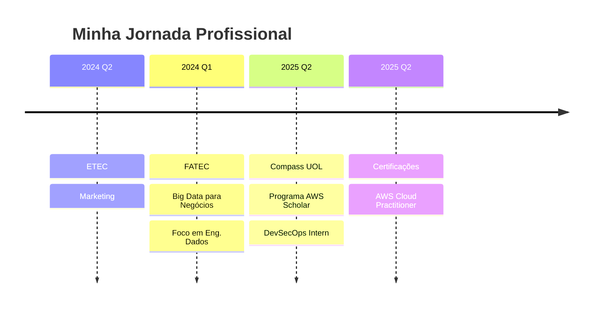

<div align="center">

# 👋 Olá! Seja bem-vindo ao meu GitHub!


</div>


<p align="left">
  😉 Meu nome é <strong>Thiago Cardoso</strong> e sou estagiário em <strong>DevSecOps</strong> na <strong>Compass UOL</strong>, como parte do programa <strong>AWS Scholar</strong>.
</p>

<p align="left">
  🎓 Atualmente curso <strong>Big Data para Negócios</strong> na FATEC, com foco em Engenharia de Dados, Cloud e Estatística.
</p>

<p align="left">
  🚀 Apaixonado por tecnologia, estou construindo um portfólio técnico voltado para <strong>Cloud, DevSecOps e Engenharia de Dados</strong>, com projetos práticos, pipelines CI/CD, automações e boas práticas de segurança.
</p>

<br clear="both"/>

---

## 📊 Estatísticas do GitHub

<div align="center">
  
</div>

<div align="center">
  
</div>

---

## 🧠 Stack de Conhecimento

<table align="center">
<tr>
<td width="50%">

### 💻 **Linguagens & Scripting**
```python
languages = {
    "Python": "APIs, automações, data analysis",
    "Bash/Shell": "Scripts de infraestrutura",
    "SQL": "Consultas e análise de dados",
    "JavaScript": "Desenvolvimento web (básico)"
}
```

### 🔒 **DevSecOps & Cloud**
```yaml
devops_tools:
  containerization: ["Docker", "Docker Compose"]
  ci_cd: ["GitHub Actions", "Gitea"]
  cloud: ["AWS EC2", "S3", "IAM", "VPC"]
  iac: ["Terraform"]
  security: ["Trivy", "Bandit", "Safety"]
  os: ["Linux Ubuntu", "WSL2"]
```

</td>
<td width="50%">

### 🗄️ **Bancos de Dados**
```sql
SELECT * FROM databases WHERE knowledge_level > 'intermediate';
-- PostgreSQL ✅
-- SQLite ✅  
-- MongoDB (learning) 🔄
```

### 🛠️ **Ferramentas**
```bash
#!/bin/bash
tools=(
    "Git & GitHub"
    "VS Code + Extensions"
    "Insomnia/Postman"
    "Ubuntu CLI"
    "Docker Containers"
)
echo "Ferramentas que uso diariamente: ${tools[@]}"
```

</td>
</tr>
</table>

---

## 🚀 Tecnologias & Ferramentas

<div align="center">

### 👨‍💻 Linguagens
<p>
  
</p>

### 🗄️ Bancos de Dados  
<p>
  
</p>

### ☁️ Cloud & Infraestrutura
<p>
  
</p>

### 🛠️ Ferramentas & DevOps
<p>
  
</p>

</div>

---

## 🏆 Conquistas & Reconhecimentos

<div align="center">
  
</div>

---

## 📂 Projetos em Destaque

<div align="center">

| 🔒 **DevSecOps Pipeline** | 📊 **Data Analytics** | ☁️ **Cloud Infrastructure** |
|:---:|:---:|:---:|
|  |  |  |
| CI/CD + Docker + Security | Python + Pandas + Viz | AWS + Terraform + IaC |

</div>

### 🎯 **Detalhes dos Projetos:**

<details>
<summary>🔒 <b>Projeto DevSecOps: Pipeline CI/CD Completo</b></summary>

- **Objetivo**: Implementar pipeline de segurança desde o desenvolvimento até produção
- **Tecnologias**: Docker, GitHub Actions, Trivy, Bandit, Safety
- **Features**: 
  - ✅ Análise estática de código
  - ✅ Escaneamento de vulnerabilidades
  - ✅ Containerização segura
  - 🔄 Deploy automatizado (em desenvolvimento)

</details>

<details>
<summary>📊 <b>Análise de Dados com Python</b></summary>

- **Objetivo**: Projetos práticos de análise exploratória e visualização
- **Tecnologias**: Python, Pandas, Matplotlib, Seaborn, Jupyter
- **Datasets**: Dados financeiros, vendas, marketing digital
- **Status**: 70% concluído

</details>

<details>
<summary>☁️ <b>Infraestrutura AWS com Terraform</b></summary>

- **Objetivo**: Automatizar infraestrutura na nuvem usando IaC
- **Escopo**: EC2, S3, VPC, RDS, Load Balancer
- **Foco**: Segurança, escalabilidade e custo-benefício
- **Status**: Em planejamento para Q1 2025

</details>

---

## 💼 Experiência Profissional

<div align="center">



</div>

---

## 📈 Metas e Objetivos 2025

<table align="center">
<tr>
<td width="33%">

### 🎯 **Q1 2025**
- [ ] AWS Cloud Practitioner
- [ ] Finalizar projeto DevSecOps
- [ ] 5 projetos Python/Data
- [ ] Contribuir OSS

</td>
<td width="33%">

### 🚀 **Q2 2026**
- [ ] AWS Solutions Architect
- [ ] Kubernetes certification
- [ ] Pipeline MLOps
- [ ] Tech talks/artigos

</td>
<td width="34%">

### 💡 **Q3-Q4 2027**
- [ ] Engenheiro de Dados Jr
- [ ] Especialização Cloud
- [ ] Mentoria técnica
- [ ] Side projects

</td>
</tr>
</table>

---

## 📊 Estatísticas Detalhadas

<div align="center">
  


</div>

### 📊 **Métricas de Desenvolvimento**

<div align="center">

| Métrica | Valor | Progresso |
|:---:|:---:|:---:|
| **Commits este ano** | 100+ | 📈 |
| **Linguagens ativas** | 6+ | 🔥 |
| **Projetos ativos** | 3 | ⚡ |
| **Certificações** | 2 (planejadas) | 🎯 |

</div>

---

## 🌐 Vamos nos Conectar?

<div align="center">

[](mailto:analyticsdev.thiago@gmail.com)
[](https://www.linkedin.com/in/analyticsthiagocardoso)
[](https://api.whatsapp.com/send?phone=5511952069862)

</div>

---

## 💡 Filosofia de Desenvolvimento

<div align="center">


</div>

---

<div align="center">

## 🚀 **"Em constante evolução... Este é apenas o começo!"**


### 📫 **Sempre aberto para colaborações, ideias e networking!**

</div>

<div align="center">
  
</div>
